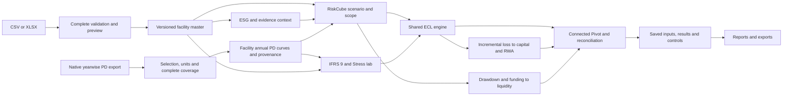

# Architecture

The JKB stress workbench adds `jkb-stress.mjs` (source-derived mechanisms), `jkb-workbook.mjs` (bounded native XML import) and `jkb-reconcile.mjs` (independent system-output controls). Shared-portfolio mode consumes RiskCube's deterministic calibrated baseline; native mode preserves a separate currency and scale. JKB results feed metric-level Pivot views and saved Reports. Source outputs are controls, never inputs to their own reconciliation calculation. Workbook parsing ignores macros and external connections; unknown inputs remain unknown.

React + TypeScript + Vite; pure JavaScript analytical modules; local browser persistence. RiskCube is the shared orchestration layer connecting exposures, ESG context, annual PD calibration, scenario transmission, credit loss, capital and liquidity. Native RiskCube integration uses a validated export adapter; no external data service or backend execution endpoint is called. ExcelJS is loaded on demand for workbook interchange. No client bank source files are bundled.

## Data flow

`src/types.ts` defines the shared workspace contract. `portfolio.mjs` validates and aggregates the facility master; `esg.mjs` calculates borrower scores, emissions attribution and evidence/taxonomy gates; `risk.mjs` supplies staging, marginal-PD ECL and capital calculations. These analytical modules have no I/O.

`riskcube-adapter.mjs` maps native exported rows to complete facility annual conditional PD curves. The selection identifies bank, model/MEF dates, native scenario, first calendar year, units and exact segment/country mapping. Missing maturity years, duplicate native keys and invalid units block calibration. A global country curve retains explicit `null` country scope. The adapter records selection, mapping and a noncryptographic data fingerprint; it does not authenticate the source or execute jobs.

`cube.mjs` uses the same starting calibration for deterministic baseline ECL, probability-weighted reporting ECL and the stressed run. Global macro PD overlays and scoped transition PD/LGD/drawdown assumptions remain explicit. ESG context joins by borrower without automatically changing PD. Consumed undrawn commitments move into drawn exposure; incremental ECL enters capital once, incremental credit-converted EAD enters RWA and drawdowns enter liquidity outflows. The result includes facility/sector traces, financial bridges and control identities under `AVATI_CONNECTED_RISK_OUTPUT_V1`.

`cube-context.mjs` provides shared calibration to IFRS 9 and Stress lab and the current connected result to the desk and Pivot. Pivot can aggregate connected starting/stressed ECL, incremental ECL, stressed EAD and drawdown, or select portfolio measures. It uses the same scenario settings and source curves; coverage gaps block dependent calculations rather than silently substituting facility PDs.

Pages own transient interaction state; `App.tsx` owns the persistent workspace. Raw source rows and selection live in `settings.cubeProjection`; `settings.cubeConfig` stores explicit scenario assumptions. Imported curves and provenance are derived for each run. Incomplete numeric drafts stay local until valid. `store.ts` and `workspace.mjs` validate restoration; `App.tsx` exposes storage failures instead of claiming a successful save.

Themes use `data-bank` at the document root. Surface, text, typography, radius, navigation, hero pattern, table and control tokens all derive from that selection; analytical inputs are not changed by a theme event.

## Versioning and lineage

Each portfolio replacement advances `portfolioVersion`. A run captures its module, bank theme, timestamp, version, summary, complete portfolio, settings and detailed model output. RiskCube capture recalculates with a fresh run ID shared by its context and output rows. Restore checks that source rows reproduce saved curves/provenance and that snapshot context, scope and contract identities agree. These are consistency checks on a local working paper, not authenticated approvals.

Saved results are never recalculated in place. Reports flag earlier portfolio versions; comparisons warn about different portfolio versions and reject incompatible module or Pivot source/grouping/measure/scope comparisons. Each snapshot offers an XLSX review containing summary and available flat facility/control/pivot tables; full nested inputs and calculation traces remain in its JSON. The whole analysis library exports as a JSON review pack. Summary CSV and print are available per snapshot.

Workspace JSON backup separately includes current facilities, settings, saved runs and local activity for restoration. The latest 500 activity events are retained and counted. Saved analyses are not silently pruned; storage failures prompt export. A saved projection that no longer covers a changed portfolio remains restorable, while connected execution stays blocked until the mapping or data is corrected.

## Deployment boundaries

The application can be served by any static HTTP server. It has no secret-bearing frontend configuration. The inspected native RiskCube API launches asynchronous jobs that write to its database; this local edition consumes exported results only and declares `liveBackendConnected: false`. The [adapter contract](RISKCUBE_ADAPTER.md) documents the inspected schema, execution boundary and PD interpretation limits.

A real bank deployment needs a separately designed trust boundary: authenticated API, role-based authorization, governed job execution, encrypted persistence, evidence retention, independent review identities, approved annual PD interpretation and calibration, full cashflow/liquidity models, scalable ingestion and an independent validation process. The current browser-local version does not supply those services.
